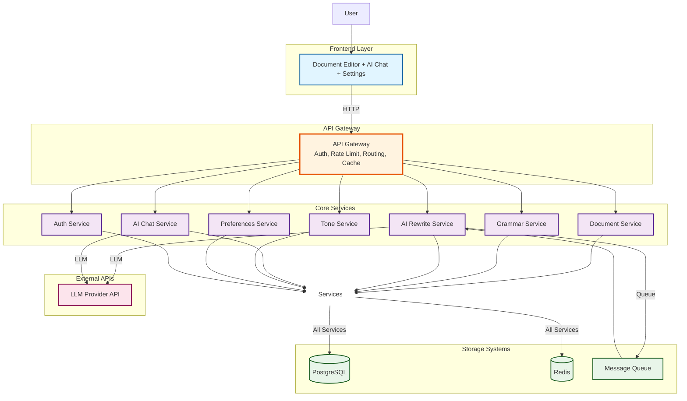

# Grammarly Architecture Diagram

## Back-of-the-Envelope Calculations

### Assumptions
- **Active Users**: 1M daily active users (DAU)
- **Peak Concurrent**: 100K simultaneous users (10% of DAU)
- **Average Document Size**: 5KB (500 words)
- **Typing Rate**: 50 WPM, generates ~1 analysis request every 2 seconds
- **Analysis Requests**: Peak 50K requests/second (100K users × 0.5 req/sec)
- **AI Chat Requests**: 5K requests/second (10% of users engage with chat)
- **Document Storage**: 10 documents/user average, 50MB total/user

### Capacity Requirements
- **Request Rate**: 55K requests/second (peak)
- **Storage**: 50TB user data (1M users × 50MB)
- **Bandwidth**: ~275 MB/s (55K req/sec × 5KB avg)
- **LLM API Calls**: ~5K requests/second (chat + rewrite operations)
- **Database**: Read-heavy (100:1 read:write ratio)

## System Architecture

## Communication Patterns Legend

- **HTTP/REST** (Solid arrows): API Gateway routes requests to services
- **Storage Connections** (Solid arrows): Services communicate via shared storage (PostgreSQL, Redis, Message Queue)
- **Service-to-Service**: Services communicate indirectly through shared storage rather than direct HTTP calls
- **External APIs** (Solid arrows): Direct calls to external LLM services

## Key Data Flows

### 1. Document Operations Flow
1. User edits document in Frontend
2. Frontend → API Gateway (HTTP)
3. API Gateway → Document Service (HTTP)
4. Document Service → PostgreSQL (DB) for persistence
5. Document Service → Redis (Cache) for quick access

### 2. Grammar Analysis Flow
1. User types → Frontend → API Gateway
2. API Gateway → Grammar Analysis Service (HTTP)
3. Grammar Service → Redis (Cache) to check cached results
4. Grammar Service → PostgreSQL (via shared storage) to fetch user-specific rules from Preferences
5. Grammar Service processes and → Redis (Cache) stores results
6. Results → API Gateway → Frontend (HTTP)

### 3. AI Rewrite Flow
1. User requests rewrite → Frontend → API Gateway
2. API Gateway → AI Rewrite Service (HTTP)
3. AI Rewrite Service → Redis/PostgreSQL (via shared storage) to fetch preferences and document context
4. AI Rewrite Service → LLM Provider API (HTTP) for rewriting
5. For long operations: AI Rewrite Service → Message Queue → Process asynchronously
6. Results → Redis (Cache) → API Gateway → Frontend

### 4. AI Chat Flow
1. User sends chat message → Frontend → API Gateway
2. API Gateway → AI Chat Service (HTTP)
3. AI Chat Service → Redis/PostgreSQL (via shared storage) to fetch document and preferences
4. AI Chat Service → LLM Provider API (HTTP) with document context
5. AI Chat Service → PostgreSQL (DB) to save chat history
6. AI Chat Service → Redis (Cache) for active session context
7. Response → API Gateway → Frontend

### 5. Authentication Flow
1. User login → Frontend → API Gateway
2. API Gateway → Authentication Service (HTTP)
3. Authentication Service → PostgreSQL (DB) to validate credentials
4. Authentication Service → Redis (Cache) to store active session
5. JWT token → API Gateway → Frontend
6. All subsequent requests include JWT in headers

## Shared Data

### Document Data
- **Content**: Stored by Document Service, accessed by Grammar, AI Chat, AI Rewrite, Tone services via shared storage
- **Storage**: PostgreSQL (primary), Redis (cache)
- **Communication**: Services access document data through PostgreSQL/Redis rather than direct service calls

### User Preferences
- **Settings**: Tone, Voice, Intent, Formality, Profession, Language
- **Storage**: PostgreSQL (primary), Redis (cache)
- **Shared with**: AI Rewrite, AI Chat, Grammar services access preferences via shared storage for context-aware processing

### Authentication & Session
- **JWT Tokens**: Validated by API Gateway, passed to all services
- **Session Data**: Stored in Redis, validated via Authentication Service
- **Flow**: API Gateway validates → passes user context to all services

### Analysis Results
- **Grammar Suggestions**: Cached in Redis, returned to Frontend
- **Tone Analysis**: Cached in Redis, shared across services
- **Chat History**: Stored in PostgreSQL, cached in Redis for active sessions

### LLM API Responses
- **Rewritten Text**: LLM API → AI Rewrite Service → Cache → Frontend
- **Chat Responses**: LLM API → AI Chat Service → Cache → Frontend
- **Context**: Includes document content and user preferences

## System Scope

### Core Functionality
The system provides a comprehensive writing assistance platform that combines rule-based grammar checking with AI-powered text enhancement capabilities:

- **Real-time Grammar Checking**: Continuous analysis of text as users type, detecting grammar errors, spelling mistakes, and style issues using rule-based engines
- **AI-Powered Text Rewriting**: Intelligent text improvement suggestions and complete rewrites based on user preferences and context
- **AI Chat Assistance**: Conversational interface that helps users understand writing suggestions, answer questions about their text, and provide writing guidance
- **Voice and Tone Customization**: User-configurable settings for formality level, tone, profession-specific language, and writing intent that influence all AI-powered features

### User Interfaces
The system exposes three primary user-facing interfaces:

- **Document Editor**: Rich text editing interface with real-time inline suggestions, highlighting, and correction capabilities
- **AI Chat**: Sidebar or modal interface for conversational interactions with the AI assistant about writing improvements
- **Voice Settings**: Configuration interface for adjusting tone, formality, profession, and language preferences that personalize the AI behavior

### System Boundaries

**Included in Scope:**
- Real-time grammar and spelling checking
- AI-powered text analysis and rewriting
- User preference management and personalization
- Multi-LLM integration with fallback mechanisms
- Caching and performance optimization
- Document storage and history
- Request routing and authentication

**Out of Scope:**
- User authentication provider implementation details (assumes existing auth service)
- Deployment infrastructure and containerization specifics
- Payment processing and subscription management
- Email notifications and external communication channels
- Mobile application clients (desktop/web only)
- Third-party integrations beyond grammar and LLM APIs

## Key External Dependencies

### Grammar API Services
- **LanguageTool / Gramformer**: Primary service for rule-based grammar checking and spelling correction
  - Provides comprehensive grammar rules for multiple languages
  - Handles spelling correction, punctuation, and style suggestions
  - Critical dependency for real-time grammar analysis
  - Failure impact: Grammar checking would be unavailable; system would rely solely on AI-based suggestions

### Large Language Model (LLM) Providers
- **Gemini API**: Google's LLM service for AI-powered rewriting and chat
  - Used for text generation, rewriting, and conversational responses
  - Part of multi-provider strategy for redundancy

- **OpenAI API**: Provides GPT models for text analysis and generation
  - Primary or secondary LLM option depending on configuration
  - Handles complex rewriting tasks and chat interactions

- **Claude API**: Anthropic's LLM service as additional provider option
  - Alternative LLM for text enhancement and chat
  - Used for load balancing and provider diversity

- **Local Quantized Model (Ollama / Llama.cpp)**: Fallback option for offline or cost-sensitive scenarios
  - Runs locally or on-premise to reduce external API costs
  - Provides basic AI capabilities when external APIs are unavailable
  - Lower performance but higher availability

### Data Storage
- **Database**: Primary persistent storage for documents, user preferences, chat history, and system state
  - Stores all user-generated content and settings
  - Critical for data persistence and user experience continuity
  - Failure impact: Users cannot access their documents or preferences

- **Redis Cache**: High-performance in-memory cache for frequently accessed data
  - Caches grammar analysis results, user preferences, and session data
  - Reduces database load and improves response times
  - Failure impact: Increased latency and database load, but system remains functional

### Dependency Management Strategy
- **Multi-provider LLM approach**: Model Router selects and falls back between providers to ensure availability
- **Caching layer**: Redis reduces dependency on external grammar API calls and database queries
- **Graceful degradation**: System can operate with reduced functionality if some dependencies are unavailable

## Key Components and Connectors

### User Interface Layer

**Document Editor**
- Primary interface for text input and editing
- Displays real-time grammar suggestions and highlights
- Connects to: API Gateway via HTTP/REST
- Receives: Grammar suggestions, rewrite options, document content
- Sends: Text changes, user actions, document updates

**AI Chat**
- Conversational interface for writing assistance
- Provides context-aware responses about user's document
- Connects to: API Gateway via HTTP/REST
- Receives: AI-generated chat responses, document context
- Sends: User messages, chat history, document references

**Voice Settings (Tone, Formality, etc.)**
- Configuration interface for personalization preferences
- Manages tone, formality level, profession, and language settings
- Connects to: API Gateway via HTTP/REST
- Receives: Current preference values
- Sends: Preference updates, settings changes

### API Gateway
- **Purpose**: Central entry point for all client requests
- **Responsibilities**:
  - Authentication and authorization validation
  - Rate limiting and request throttling
  - Input sanitization and security checks
  - Request routing to appropriate services
  - Response aggregation and error handling
- **Connectors**:
  - Receives: HTTP/REST requests from all UI components
  - Routes to: Real-time Grammar Engine, AI Engine, User Profile service
  - Validates: JWT tokens, request payloads, user permissions

### Core Services

**Real-time Grammar Engine (Rules + Spelling)**
- **Purpose**: Fast, rule-based grammar and spelling checking
- **Functionality**: Analyzes text using predefined rules and spelling dictionaries
- **Connectors**:
  - Receives: Text content from API Gateway
  - Queries: Grammar API (LanguageTool/Gramformer) for rule-based analysis
  - Stores: Results in Database and Redis Cache
  - Returns: Grammar suggestions to API Gateway

**AI Engine (Rewrite & Chat Logic)**
- **Purpose**: Orchestrates AI-powered features including text rewriting and chat
- **Functionality**: Coordinates between Prompt Builder, Model Router, and external LLMs
- **Connectors**:
  - Receives: Rewrite requests, chat messages from API Gateway
  - Uses: Prompt Builder for context assembly
  - Routes: Through Model Router to appropriate LLM
  - Stores: Results in Database and Cache
  - Returns: AI-generated responses to API Gateway

**User Profile & Preferences**
- **Purpose**: Manages user-specific settings and preferences
- **Functionality**: Stores and retrieves tone, formality, profession, language, and other personalization settings
- **Connectors**:
  - Receives: Preference updates from API Gateway
  - Stores: User data in Database
  - Provides: Preferences to Prompt Builder and other services
  - Caches: Frequently accessed data in Redis

**Prompt Builder (Context + Tone)**
- **Purpose**: Assembles contextual prompts for LLM requests
- **Functionality**: Combines document content, user preferences, tone settings, and task-specific instructions
- **Connectors**:
  - Receives: Context from AI Engine
  - Retrieves: User preferences from User Profile
  - Passes: Assembled prompts to Model Router
  - Ensures: Consistent prompt structure across all LLM calls

**Model Router (LLM Selection + Fallback)**
- **Purpose**: Intelligently routes requests to appropriate LLM provider
- **Functionality**:
  - Selects optimal LLM based on task type, cost, and availability
  - Implements fallback logic when primary provider fails
  - Manages load balancing across multiple providers
  - Caches responses to reduce API calls
- **Connectors**:
  - Receives: Prompts from Prompt Builder
  - Queries: Redis Cache for cached responses
  - Routes to: Gemini API, OpenAI API, Claude API, or Local LLM (Ollama/Llama.cpp)
  - Handles: Provider failures and fallback scenarios
  - Returns: LLM responses to AI Engine

### Storage Layer

**Redis Cache**
- **Purpose**: High-performance caching for frequently accessed data
- **Stores**: Grammar analysis results, user preferences, LLM response cache, session data
- **Connectors**:
  - Accessed by: Real-time Grammar Engine, Model Router, User Profile, AI Engine
  - Provides: Fast data retrieval to reduce database and external API calls

**Database (Documents & History)**
- **Purpose**: Persistent storage for all user data
- **Stores**: Documents, user preferences, chat history, document versions
- **Connectors**:
  - Accessed by: Real-time Grammar Engine, AI Engine, User Profile
  - Provides: Long-term data persistence and retrieval

### Connection Patterns

**HTTP/REST Connections**
- Primary communication protocol between UI components and API Gateway
- Used for all user-initiated requests and responses
- Supports real-time updates and streaming responses

**Service-to-Service Communication**
- Services communicate through shared storage (Database, Redis) rather than direct HTTP calls
- Ensures loose coupling and scalability
- Reduces inter-service dependencies

**External API Calls**
- Model Router makes HTTP requests to external LLM providers
- Real-time Grammar Engine queries Grammar API services
- All external calls include timeout and retry logic

**Cache Interactions**
- Read-through pattern: Check cache first, then database/external API
- Write-through pattern: Update both cache and database simultaneously
- Cache invalidation: Proactive updates when data changes
